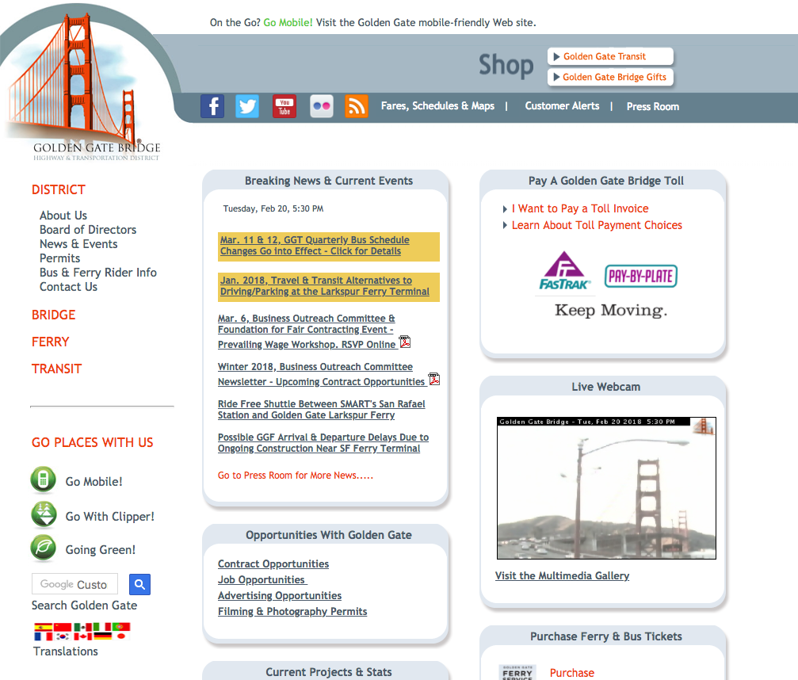
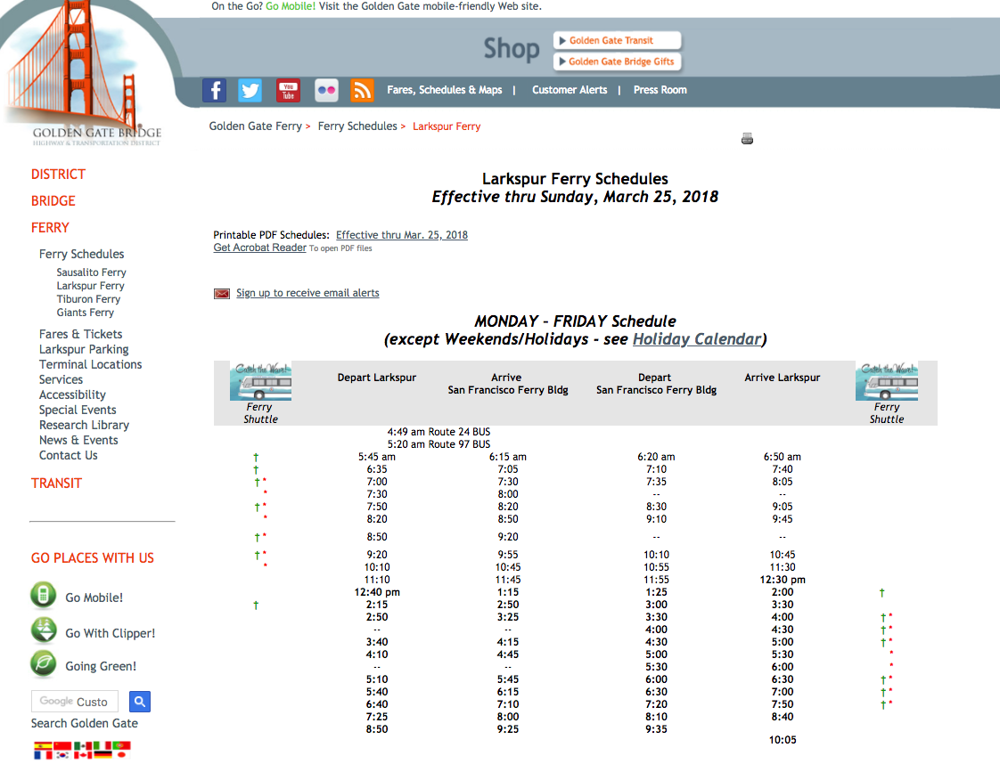

# Project Name: Ferry Finder

## Reason for Building this Project: 
 Growing up just north of San Francisco in Marin County we have ferries that take us to the city, however, the webpage to figure out information and schedules looks like this: 

 

 

 The Golden Gate Ferry webpage is difficult to navigate and has a terrible user experience. For scheduling, I, myself, along with friends would often misread ferry times in one area for another causing us difficulties when we went to board the ferry. In talking with people who rode the ferry whether they were commuters or infrequent users they would both tell me how much they enjoyed the experience. With that in mind I felt that the design of the website should make it more inviting for new users and reflective of the experience users enjoy when riding it. 

## Process 

## User Stories 

- I knew to design this application properly I would have to think of how different users interacted with the ferry website. 

Story 1 - The Commuter 

- The commuter takes the ferry five days a week and often doesn't even need to go to the website because they have their usual ferry they take. There are those times when they wake up late, or have to do something unexpected in the morning that causes them to need to look up later ferry times. They don't want to have to click and scroll through multiple different pages just to see the times, they want it to be quick and easy so they can go on with their day. 

Design Approach - Build the app so users can access ferry times simply and quickly because that is the only reason why some users will go to the page. In additon, optimize mobile design so they can use it on the go. 

Story 2 - The Traveler 

- The Bay Area is a big place and there are many areas to see. Staying in San Francisco someone is told they should check out Marin! They come to the webpage unsure of where Marin is and where the ferry departs from. This webpage potetnially will be their first introduction to the area besides the recommendation to check it out. 

Design Approach - Make the webpage visually appealing with images of Marin. Clearly display routes of the ferries, ticket prices and where/how they can purchase them. Attempt to answer all the small questions a new user might ask. 

Story 3 - The Local Who Infrequently Uses the Ferry - My Mom and Dad

The ferry doesn't work out for everyone to commute on, but people still love to take it when they can. For the local, maybe they are thinking of exploring San Francisco for a Saturday or wondering if there's a ferry back at a certain time.

Design Approach - Make the page visually appealing and have it provide the necessary information for the local to convince them of why they should use the ferry and how they can make a great day out of it. Answering questions like parking, whether or not they can bring their bike aboard, and when the ferry will be holiday scheduling. 

 

